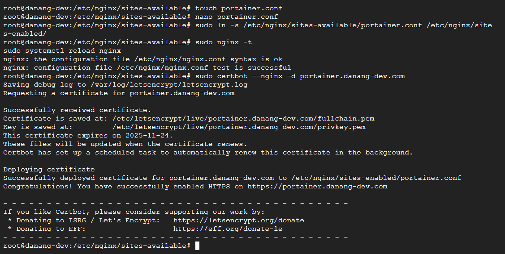

# Set up a new Portainer Community Edition Server installation

## Requirements and prerequisites

In order to access the UI and API, and for the Portainer Server instance and the Portainer Agents to communicate, certain ports need to be accessible.

On the Portainer Server the following ports must be open:
- TCP port 9443 (or 30779 for Kubernetes with NodePort) for the UI and API

- TCP port 8000 (or 30776 for Kubernetes with NodePort) for the TCP tunnel server for Edge Agents. This port is optional and only required if using Edge Compute features with Edge Agents.

For the Portainer Agent:
- TCP port 9001 (or 30778 for Kubernetes with NodePort) must be accessible on the Agent from the Portainer Server instance.

## Deployment

First, create the volume that Portainer Server will use to store its database:

```bash
docker volume create portainer_data
```

Then, download and install the Portainer Server container:

```bash
docker run -d -p 8000:8000 -p 9443:9443 --name portainer --restart=always -v /var/run/docker.sock:/var/run/docker.sock -v portainer_data:/data portainer/portainer-ce:lts
```

Check to see whether the Portainer Server container has started by running docker ps:


## Setup Reverse Proxy

Create new file:

```bash
cd /etc/nginx/sites-available/
```

```bash
touch portainer.conf
```

Add Portainer DNS record

- Type : A
- Name : Portainer
- Vales : `[Your IP]`
- TTL : Default


follow this:

```bash
server {
    listen 80;
    server_name portainer.danang-dev.com;

    location / {
        proxy_pass https://localhost:9443;
        proxy_ssl_verify off; # abaikan self-signed cert milik Portainer
        proxy_set_header Host $host;
        proxy_set_header X-Real-IP $remote_addr;
        proxy_set_header X-Forwarded-For $proxy_add_x_forwarded_for;
        proxy_set_header X-Forwarded-Proto $scheme;
    }
}
```

Activate Config

```bash
sudo ln -s /etc/nginx/sites-available/portainer.conf /etc/nginx/sites-enabled/
```

Check & Reload Config

```bash
sudo nginx -t
sudo systemctl reload nginx
```

```bash
sudo certbot --nginx -d portainer.danang-dev.com
```



## Overview


